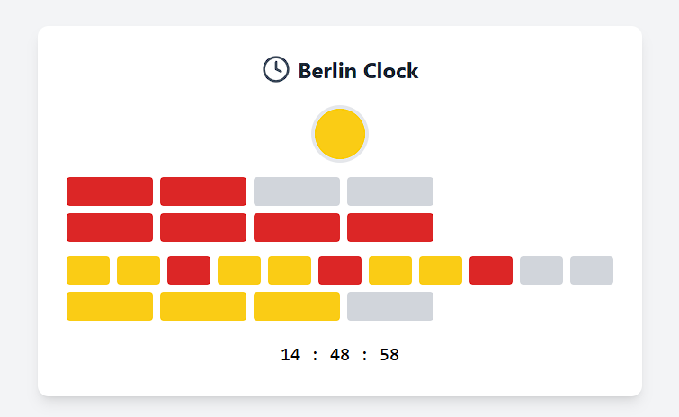

# Berlin Clock Project 🕒

## Overview

The Berlin Clock (Mengenlehreuhr) is a unique way to display time using illuminated colored blocks. This digital version recreates the famous clock design in a modern web application using React.



## Features

- Real-time updates every second
- Accurate representation of the original Berlin Clock design
- Color-coded time blocks (red, yellow, and off states)

## 🚀 Quick Start

### Prerequisites

- Node.js (v14.0.0 or higher)
- npm (v6.0.0 or higher)

### Installation

1. Clone the repository:
```bash
git clone <your-repository-url>
cd berlin-clock
```

2. Run the automatic setup script:
```bash
node setup.js
```

Or manually install and run:
```bash
cd BerlinClock
npm install
npm run dev
```

The application will start at `http://localhost:5173`.

## 🧩 How the Berlin Clock Works

The Berlin Clock consists of several rows of lamps:

- **Top Light**: A yellow lamp that blinks on/off every two seconds
- **Hour Rows**: 
  - Top row: 4 red lamps, each representing 5 hours
  - Bottom row: 4 red lamps, each representing 1 hour
- **Minute Rows**:
  - Top row: 11 lamps, each representing 5 minutes (every third lamp is red, others are yellow)
  - Bottom row: 4 yellow lamps, each representing 1 minute

### Reading the Time

1. The top round light blinks every second
2. The first row shows 5-hour blocks (multiply lit blocks by 5)
3. The second row shows 1-hour blocks (add to the 5-hour blocks)
4. The third row shows 5-minute blocks (multiply lit blocks by 5)
5. The bottom row shows 1-minute blocks (add to the 5-minute blocks)

## 🛠️ Technical Details

### Built With

- React
- Tailwind CSS
- Lucide React (for icons)

### Project Structure

```
berlin-clock/
├── src/
│   ├── components/
│   │   ├── BerlinClockUI.jsx
│   │   └── Berlin-clock.js
│   ├── assets/
│   │   └── loading.svg
│   └── App.jsx
├── setup.js
└── package.json
```

### Component Architecture

- `BerlinClockUI`: Main presentation component
- `Berlin-clock.js`: Core logic for time calculations

## 📱 Browser Support

- Chrome (latest)
- Firefox (latest)
- Safari (latest)
- Edge (latest)

## 🙏 Acknowledgments

- Original Berlin Clock design by Dieter Binninger
- React community for awesome tools and support
- All contributors who participate in this project